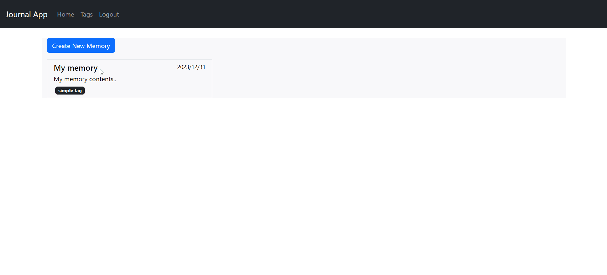

<<<<<<< HEAD
# **Personal Journal App**
The Personal Journal App is a simple memory journaling App that allows users to record moments about their current day and write something memorable about them. It has the ability to add tags so that users can remember what exactly the moment or memory was about. It also has support to add images (URL for now) to add some images. 

<p align="center">
    <a href="https://personal-journal-app.vercel.app/login">
        
    </a>
</p>

## **Table of Contents:**
1. <a href="#1-about">About</a>
2. <a href="#2-running-the-application">Running the application</a>
3. <a href="#3-technologies-used">Technologies Used</a>
4. <a href="#4-branches">Branches</a>


## <a>**1. About**</a>
The personal journal app has support for login and logout to maintain privacy of user memories. For starter, a new user can click on the sign up tab to create its credentials and get started with the application.
The application has support for tags to add a tag to the memory as well. Users can create and delete tags. 

## <a>**2. Running the Application locally**</a>

### a. Prerequisites
The application is built on Java, Spring boot and Angular, Typescript for frontend. The requirements are as follows
- Spring Boot v3.2.1
- NodeJs v20
- Angular CLI v17
- OpenJDK 17

### b. Configuring the backend
The backend is built on top of Spring Boot, and there are 2 profiles configured that are 
```
application-dev.properties
application-prod.properties
```
It is recommended to configure the `spring.profiles.active` present in `application.properties` to the value `dev` and define the required properties as per local environment
For SSL to work locally please ensure that you have created a self-signed certificate to enable `https` on local backend application
Dependencies will automatically be taken care of as the `pom.xml` file has all the required dependencies.
CORS configuration can be done under `config` package and `Security-Config` file

### c. Configuring the frontend
The frontend is built on Angular and Typescript, and it has a configuration file called `config.ts` present in `assets` folder 
Here you can define the local backend URL and that will be used throughout the application to communicate with the APIs
You can run the angular application locally by 
```
npm install
ng serve
```

### d. Configuring the database
The application is using MongoDB for its data storage, and the connection URI must be mentioned in the `properties` file of the active profile being used by spring boot.

## <a>**3. Technologies Used**</a>
- **Angular** for Frontend
- **Typescript** as frontend language
- **Java** as backend language
- **Spring Boot** as backend framework
- **MongoDB** as database storage

## <a>**4. Branches**</a>
The application has 3 major branches
- **main** that has both client and server code
- **backend** that is a production-ready branch for backend code deployed on Railway.dev
- **frontend** that is a production-ready branch for frontend code deployed on Vercel

<br>
<hr>
<sub>Developed by Abdulmateen Pitodia (abdul-pitodia)</sub>
=======
# MyApp

This project was generated with [Angular CLI](https://github.com/angular/angular-cli) version 17.0.8.

## Development server

Run `ng serve` for a dev server. Navigate to `http://localhost:4200/`. The application will automatically reload if you change any of the source files.

## Code scaffolding

Run `ng generate component component-name` to generate a new component. You can also use `ng generate directive|pipe|service|class|guard|interface|enum|module`.

## Build

Run `ng build` to build the project. The build artifacts will be stored in the `dist/` directory.

## Running unit tests

Run `ng test` to execute the unit tests via [Karma](https://karma-runner.github.io).

## Running end-to-end tests

Run `ng e2e` to execute the end-to-end tests via a platform of your choice. To use this command, you need to first add a package that implements end-to-end testing capabilities.

## Further help

To get more help on the Angular CLI use `ng help` or go check out the [Angular CLI Overview and Command Reference](https://angular.io/cli) page.
>>>>>>> 9658fe489d3d77af7890e8be5dbccfc20c4a086b
